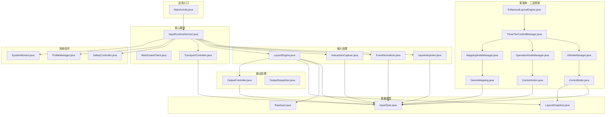

# 安卓端项目依赖关系分析

## 1. 整体架构依赖图



## 2. 详细依赖关系

### 2.1 InputRuntimeService 的依赖
```
InputRuntimeService
├── android.app.Service (继承)
├── RuntimeConfig (创建)
├── ProfileManager (创建)
├── InputScriptEngine (创建)
├── InteractionCapture (创建)
├── LayoutEngine (创建)
├── OutputController (创建)
├── SafetyController (创建)
├── TransportController (创建)
├── OverlayController (创建)
├── InputInterpreter (创建)
├── EventNormalizer (创建)
├── RegionResolver (创建)
├── SystemMonitor (使用)
├── InputState (创建)
├── RawInput (使用)
└── MainActivity (启动Intent)
```

### 2.2 LayoutEngine 的依赖
```
LayoutEngine
├── LayoutSnapshot (使用)
├── InputState (创建)
├── RawInput (使用)
├── UILayerHandler (创建)
├── OperationLayerHandler (创建)
├── MappingLayerHandler (创建)
├── OutputController (使用)
├── LayoutLoader (创建)
└── android.util.Log (使用)
```

### 2.3 新三层架构依赖
```
EnhancedLayoutEngine
├── ThreeTierControlManager
│   ├── UINodeManager
│   │   └── ControlNode
│   ├── OperationNodeManager
│   │   └── ControlAction
│   └── MappingNodeManager
│       └── DeviceMapping
├── LayoutSnapshot (使用)
├── InputState (创建)
├── RawInput (使用)
├── LayoutToControlNodeConverter (使用)
└── DeviceMapping (参数)

ThreeTierControlManager
├── UINodeManager
├── OperationNodeManager
├── MappingNodeManager
├── InputState (创建)
├── RawInput (使用)
└── LayoutSnapshot (使用)
```

## 3. 循环依赖检测

### 3.1 检测到的潜在循环依赖

1. **InputRuntimeService ↔ LayoutEngine**
   - InputRuntimeService 创建 LayoutEngine
   - LayoutEngine 可能间接回调 InputRuntimeService

2. **ProfileManager ↔ LayoutEngine**
   - ProfileManager 持有 LayoutEngine 引用
   - 可能存在相互依赖

### 3.2 解决方案

```java
// 使用接口隔离，避免直接依赖
public interface LayoutEngineProvider {
    InputState executeLayout(RawInput rawInput, long frameId);
    void setLayout(LayoutSnapshot layout);
    LayoutSnapshot getCurrentLayout();
}

// 在ProfileManager中使用接口而非具体实现
public class ProfileManager {
    private LayoutEngineProvider layoutEngineProvider;
    
    public ProfileManager(Context context, InputScriptEngine scriptEngine, 
                         LayoutEngineProvider layoutEngineProvider) {
        this.layoutEngineProvider = layoutEngineProvider;
        // ...
    }
}
```

## 4. 耦合度分析

### 4.1 高耦合组件
- **InputRuntimeService**: 耦合度过高，依赖过多组件
- **LayoutEngine**: 与多个处理器紧密耦合

### 4.2 低耦合组件
- **ControlNode/ControlAction/DeviceMapping**: 设计良好，职责单一

## 5. 建议的重构方案

### 5.1 减少InputRuntimeService的耦合

```java
// 创建专门的服务管理器
public class ServiceManager {
    private final InputCollector inputCollector;
    private final LayoutManager layoutManager;
    private final OutputManager outputManager;
    private final NetworkManager networkManager;
    
    public ServiceManager(Context context) {
        inputCollector = new InputCollector(context);
        layoutManager = new LayoutManager(context);
        outputManager = new OutputManager(context);
        networkManager = new NetworkManager(context);
    }
    
    public void start() {
        inputCollector.start();
        layoutManager.initialize();
        outputManager.start();
        networkManager.connect();
    }
    
    public void stop() {
        networkManager.disconnect();
        outputManager.stop();
        layoutManager.cleanup();
        inputCollector.stop();
    }
}

// 简化后的InputRuntimeService
public class InputRuntimeService extends Service {
    private ServiceManager serviceManager;
    
    @Override
    public void onCreate() {
        serviceManager = new ServiceManager(this);
    }
    
    @Override
    public int onStartCommand(Intent intent, int flags, int startId) {
        serviceManager.start();
        return START_STICKY;
    }
}
```

### 5.2 使用依赖注入模式

考虑引入轻量级依赖注入框架或手动实现依赖注入：

```java
public class AppComponent {
    private final Context context;
    private final InputScriptEngine scriptEngine;
    private final OutputController outputController;
    
    public AppComponent(Context context) {
        this.context = context;
        this.scriptEngine = new JsInputScriptEngine(context);
        this.outputController = new OutputController();
    }
    
    public InputScriptEngine getScriptEngine() { return scriptEngine; }
    public OutputController getOutputController() { return outputController; }
    
    public ServiceComponent plusServiceComponent() {
        return new ServiceComponent(this);
    }
}

public class ServiceComponent {
    private final AppComponent appComponent;
    
    public ServiceComponent(AppComponent appComponent) {
        this.appComponent = appComponent;
    }
    
    public InputRuntimeService createInputRuntimeService() {
        return new InputRuntimeService(
            appComponent.getScriptEngine(),
            appComponent.getOutputController()
        );
    }
}
```